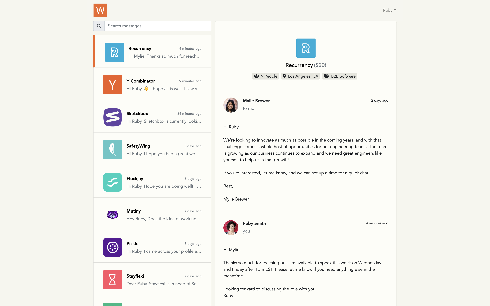

# README



## About

This is a tiny demo of an inbox web app where job seekers and startup founders can have 1-to-1 conversations with eachother.

Features include:
* Founder and candidate login
* 1-to-1 messaging
* Infinite scrolling + pagination
* Search filter
* Conversations ordered by most recent message
* Mobile responsive layout

## How to run locally

### Prerequisites

You'll need the following dependencies installed on your machine
- [Ruby](https://www.ruby-lang.org/en/documentation/installation/) version 2.6.3
- [Node.js](https://nodejs.org/en/download/) version 8.16.0 or later
- [Yarn](https://classic.yarnpkg.com/en/docs/install) 1.22.0 or later
- [Rails](https://guides.rubyonrails.org/getting_started.html) 6.0.0 or later
- [PostgreSQL](https://www.postgresql.org/) 10.0 or later

### Installation
Clone the repository
```
$ git clone https://github.com/kkdaily/waas_inbox_demo.git
```

Navigate to the root folder
```
$ cd waas_inbox_demo
```

Install dependencies
```
$ bundle install
```

### Configure the database
Edit `config/database.yml` and update the `username` and `password` under the `default` section with your PostgreSQL user.

Run the following command in your terminal to create a development and test database
```
$ rails db:create
```

Run the migrations
```
$ rails db:migrate
```
Seed the database with test data
```
$ rails db:seed
```

### Running the server
```
$ rails s -p=3001
```
the app should now be running on `http://localhost:3001`.

